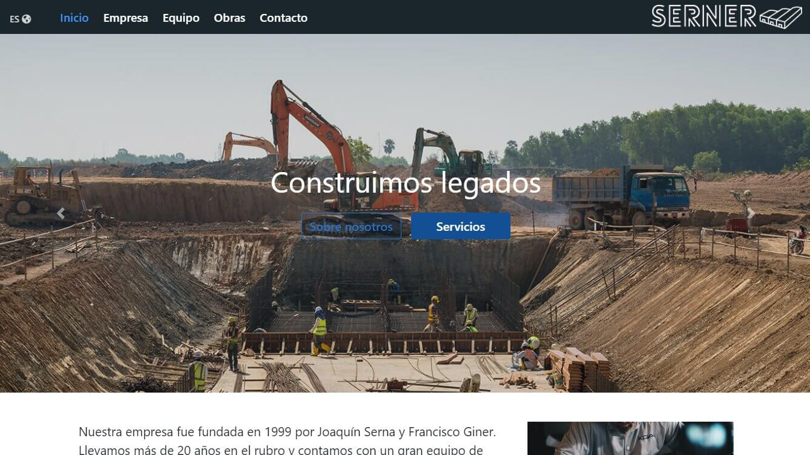

# Serner
Sitio web de empresa constructora

### 🚀 [Pulsa aqui para ver una demo de la web](https://serner.netlify.app)

**Este sitio web no requiere de gestores de paquetes o comandos, puedes abrir cualquier archivo .html con un navegador para visualizar el sitio.**

### Sobre el proyecto:
Diseñe y desarrolle este sitio web como mi proyecto final para el curso de desarrollo web en CoderHouse.
Tanto la empresa como el contenido son inventados.

**A mejorar:**
- Reducir el uso de utilidades en clases css
- Implementar JS para realizar los cambios de idioma